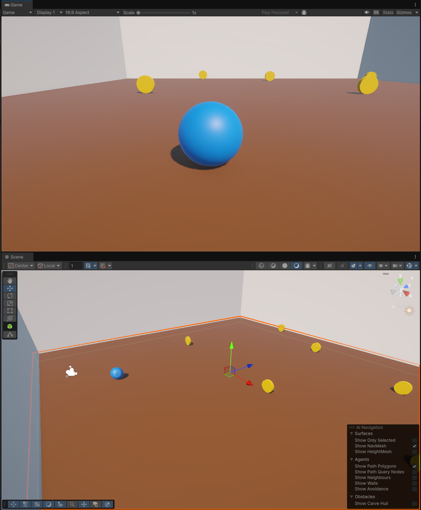

# Conhecimento
Teste de conhecimento sobre unity

### **Lista de Tarefas para Implementação de Funcionalidades**

---

#### **1. Programação e Scripting**
1. **Gerenciamento de Estados:**
   - Implementar uma máquina de estados para o jogador (ex.: Idle, Movendo, Pulando).
   - Criar uma máquina de estados para inimigos (ex.: Patrulha, Perseguição, Ataque, Morte).
2. **Eventos e Delegates:**
   - Usar eventos para notificar o sistema quando uma moeda for coletada.
   - Criar um evento para disparar a geração de inimigos após um número específico de moedas coletadas.
3. **Otimização de Código:**
   - Refatorar o código para usar padrões de design como Singleton para gerenciadores globais (ex.: Gerenciador de Moedas, Gerenciador de Inimigos).
   - Substituir chamadas repetitivas de `FindGameObjectsWithTag` por listas ou pools de objetos para melhorar a performance.

---

#### **2. Mecânicas de Jogo**
1. **Sistema de Coleta de Moedas:**
   - Adicionar um contador de moedas coletadas e exibir no HUD.
   - Implementar feedback visual (ex.: partículas) e sonoro ao coletar moedas.
2. **Geração de Inimigos:**
   - Criar um sistema para gerar inimigos após um número específico de moedas coletadas.
   - Configurar inimigos com comportamentos básicos (ex.: perseguição).
3. **Sistemas de Combate:**
   - Implementar um sistema de ataque para o jogador (ex.: disparo de projéteis ou ataque corpo a corpo).
   - Adicionar detecção de colisão para ataques e danos aos inimigos.

---

#### **3. Interface do Usuário (UI/UX)**
1. **HUD Dinâmico:**
   - Adicionar uma barra de vida para o jogador.
   - Exibir o número de moedas coletadas e o número de inimigos restantes.
2. **Sistema de Menus:**
   - Criar um menu de pausa com opções de continuar, reiniciar e sair.
3. **Feedback Visual**
   - Adicionar efeitos visuais (ex.: partículas) ao coletar moedas ou derrotar inimigos.

---

#### **4. Animações**
1. **Animações do Jogador:**
   - Adicionar animações para movimento, pulo e ataque (mesmo que o jogador seja uma esfera, pode usar deformações ou efeitos visuais).
2. **Animações de Inimigos:**
   - Criar animações para patrulha, perseguição, ataque e morte.
3. **Transições Suaves:**
   - Configurar transições no Animator para evitar mudanças bruscas entre animações.

---

#### **5. Inteligência Artificial (IA)**
1. **IA de Inimigos:**
   - Implementar comportamento básico de patrulha.
   - Adicionar perseguição ao jogador quando ele estiver dentro de um raio de detecção.
   - Configurar ataques ao jogador quando estiverem próximos.

---

#### **6. Programação e Arquitetura Avançada**
1. **Padrões de Design:**
   - Implementar o padrão Observer para gerenciar eventos globais (ex.: coleta de moedas, geração de inimigos).
   - Usar o padrão Factory para criar inimigos com diferentes atributos (ex.: velocidade, vida, dano).
2. **Gerenciamento de Dados:**
   - Criar um sistema de salvamento para armazenar progresso (ex.: moedas coletadas, inimigos derrotados).
   - Usar PlayerPrefs ou arquivos JSON para salvar e carregar dados.
3. **Otimização:**
   - Implementar pooling de objetos para moedas e inimigos para reduzir instâncias de `Instantiate` e `Destroy`.
   - Usar corrotinas para gerenciar tarefas assíncronas, como geração de inimigos.

---

#### **7. Outras Funcionalidades**
1. **Sistema de Inventário:**
   - Adicionar um inventário para o jogador coletar itens especiais (ex.: power-ups, chaves).
2. **Power-Ups:**
   - Criar power-ups que aumentem a velocidade, dano ou vida do jogador temporariamente.
3. **Câmera Avançada:**
   - Melhorar o comportamento da câmera para evitar obstáculos e manter o jogador sempre visível.
4. **Cenários Dinâmicos:**
   - Adicionar elementos interativos no cenário (ex.: portas que abrem com chaves, plataformas móveis).

---

### **Prioridade Inicial**
1. Implementar o contador de moedas e feedback visual/sonoro.
2. Criar o sistema básico de geração de inimigos.
3. Adicionar HUD com barra de vida e contador de moedas.
4. Melhorar a movimentação do jogador e evitar que a câmera atravesse paredes.

Essa lista cobre funcionalidades intermediárias e avançadas, bom trabalho!
